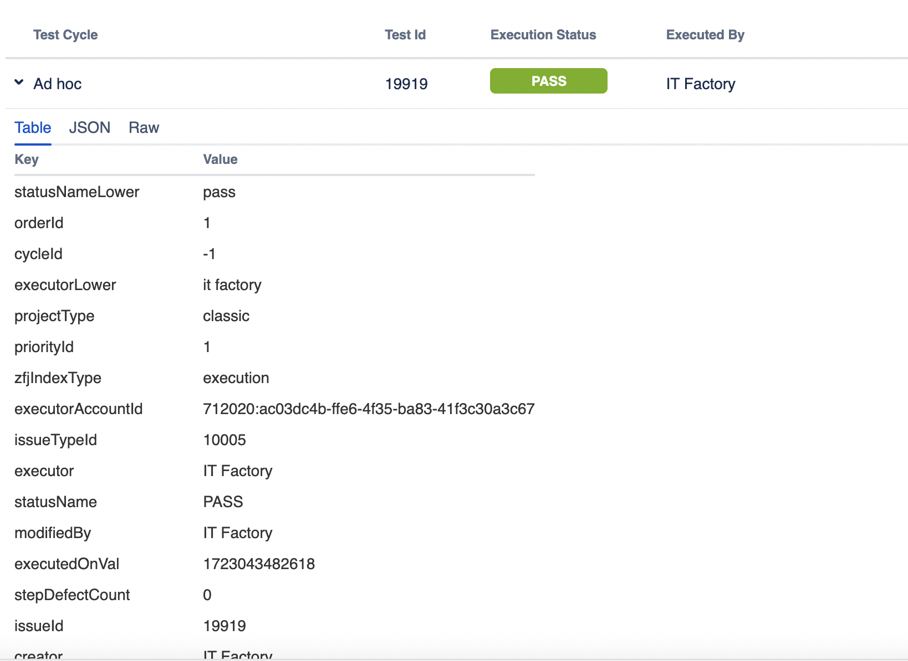

<h1>Testing Project for BEBE TEI</h1>

The scope of the final project for ITF Manual Testing Course is to use all gained knowledge throught the course and apply them in practice, using a live application

Application under test: BEBE TEI

Tools used: Jira, Zephyr Squad.

<h2>Functional specifications:</h2>

The below stories were created in Jira and describe the functional specifications of the "Manual Testing" module, for which the final project is performed upon.

Here you can find the release that was created for this project:

<h2>Testing process</h2>

The test process was performed based on the standard test process as described below.

<h3>1.1 Test planning</h3>

<a href="Test plan - Bebe Tei.pdf">Test Plan</a>

<h4>1.1.1. Roles asigned to the project and persons allocated</h4>

<ul>
  <li>Project manager:</li>Amelia Brown
  <li>Product owner:</li>Tristan Bruce
  <li>Software developer:</li>Geroge Harold
  <li>QA Engineer:</li>Pinzariu Daria
</ul>

<h4> 1.1.2 Entry criteria defined </h4>

• New account test passed (being the most basic type of test, this is a very important entry criteria in the process of testing)
• testing environment is up and running
• ability to access “My account”
• test plan approved and test data prepared
• Availability of staff for testing tasks
• Availability of test items that have met the exit criteria for any previous test levels

<h4> 1.1.3 Exit criteria defined </h4>

• 50% of tests are passed
• no Critical issues have Open status
• all remaining defects are either cancelled or documented as Change Requests for a
future release

<h4> 1.1.4 Test scope</h4>

<h5> Tests in scope: </h5>

• we plan on running a full regression test on the current version
• all the test cases are written and reviewed
• all the test data is available and reviewed (test data= email examples, password examples, different types of log in accounts , different types of dashboards )

<h5>Tests not in scope: </h5>

n/a

<h4>1.1.5 Risks detected</h4>

<h5>Project risks:</h5>

• Organizational factors: personnel problems, team conflicts
• Supplier issues: a small number of products
• Political issues: incorrect attitude towards the testing process
• Technical issues: Unclear business requirements

<h5> Product risks: </h5>

- Data Security: Compromise of users' personal and financial information.
- Performance and Scalability: Performance issues during high traffic volumes, which can lead to slowness or outages.
- Accuracy of Information: Errors in product details such as drug descriptions, prices or availability.
- Communication with Suppliers: Integration issues with supplier systems that may affect product availability and delivery.

<h4>1.1.6 Evaluating entry criteria</h4>

The entry criteria defined in the Test Planning phase have been achieved and the test process can continue.

<h3>1.2 Test Monitoring and Control<h3>

<h3> 1.3 Test Analysis </h3>

The following test conditions were found:  

<h3>1.4 Test Design</h3>

Functional test cases were created in Zephyr Squad based on the analysis of the specifications. The test cases can be accessed here: <a href="test_cases.xlsx">Test Cases</a>

<h3>1.5 Test Implementation</h3>

The following elements are needed to be ready before the test execution phase begins:

• all the test data is available and reviewed (test data= email examples, password examples, different types of log in accounts , different types of dashboards )

<h3>1.6. Test Execution </h3>

Test cases are executed on the created test Cycle summary: Testing Bebe Tei

Bugs have been created based on the failed tests. The complete bug reports can be found here: <a href="test_execution.xml">Test Execution</a>

The following is a summary of the bugs that have been found:
- The "Product list" bug does not affect the user that much, its severity is low.
- The "I forgot the password" bug has a high severity and affects the user.

Full regression testing is needed on the impacted areas after the bugs are fixed and retesting will be done for every functionality that was previously failed.

<h3> 1.7 Test Completion</h3>
As the Exit criteria were met and satisfied as mentioned in the appropriate section, this feature is suggested to ‘Go Live’ by the Testing team

The traceability matrix was generated and can be found here: 

Test execution chart was generated and can be found below. 

The final report shows that a number 2 tests have failed of a total of 10

A number of 2 total bugs were found, from which the priority is: 1 is high and 1 is medium to low.

<h4>Conclusion</h4>
During the testing process for our maternity and baby products website, a total of 10 tests were created and executed. Approximately 85% of the requirements specified in the project documentation were covered by these tests.
Some functionalities, such as integration with the inventory management system and customized delivery options, were not fully tested due to time constraints. These will require additional testing before the launch.
Regarding the identified bugs, most are minor and can be fixed without significantly impacting the product launch. However, a few critical bugs need immediate attention to avoid potential functionality issues post-launch.
Identified product risks include possible performance issues during peak traffic and synchronization errors with suppliers. These risks need to be mitigated through server optimization and strengthening integration with external partners.
We recommend delaying the launch until the testing of uncovered functionalities is completed and critical bugs are resolved. Additional time should be allocated for testing under high-traffic conditions to ensure optimal performance.
Lessons learned include the importance of adequate planning for testing complex functionalities and external integrations. This should be considered in future projects to avoid similar delays and launch issues.
